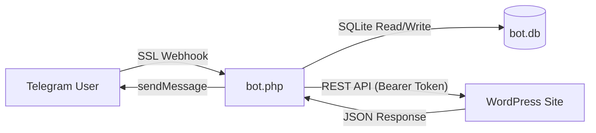

# Telegram WordPress Master Bot v2.0 - Technical Reference Manual

**Version:** 2.0.0  
**License:** GPLv2 or later  
**Author:** Shahin Ilderemi  
**Stack:** PHP 7.4+, SQLite3, WordPress REST API

---

## 📖 Introduction

The **Telegram WordPress Master Bot** is a production-grade, "headless" management system that decouples the WordPress administration interface from the WordPress backend. By utilizing the Telegram Bot API as a frontend and a lightweight custom WordPress plugin as a middleware API, this system allows agencies, freelancers, and power users to manage unlimited WordPress sites—single instances or massive Multisite Networks—from a single chat interface.

This manual documents the complete functionality, architecture, installation, and extension API of the system.

---

## 🏗 System Architecture

The system operates on a **Client-Server-Agent** model:

1.  **The Client (Telegram App)**: The UI layer. Renders menus, dashboards, and inputs via specialized "Inline Keyboards".
2.  **The Server (`bot.php`)**: The centralized "Brain". hosted on any PHP server (shared/VPS).
    *   **State Machine**: Manages user sessions and navigation flow using SQLite.
    *   **Webhook Handler**: Processes incoming updates from Telegram (Messages, Callbacks, Files).
    *   **Proxy Logic**: Forwards commands to specific WordPress sites via secure REST calls.
3.  **The Agent (`wp-telegram-connector.php`)**: The "Limb" installed on WordPress.
    *   **API Exposure**: Registers a custom namespace `tgwp/v1`.
    *   **Security Layer**: Validates Bearer Tokens and User Capabilities.
    *   **Execution**: Performs the actual WordPress actions (CRUD, System Tasks).

### Data Flow Diagram


---

## 🛠 Feature Specifications

### 1. Multisite Network Management
Full support for WordPress Multisite (WPMU).
*   **Discovery**: The system automatically detects if a connected site is a Multisite Network.
*   **Network Dashboard**: When accessing the main site of a network, the bot presents a specialized **Network Admin** dashboard.
*   **Site Management**:
    *   **List Sites**: Pagination supported list of all sub-sites/mapped domains.
    *   **Create Site**: Provision a new child site (Domain, Title, Admin Email) in seconds.
    *   **Delete Site**: Irreversible removal of child sites (protected by confirmation flow).
    *   **Context Switching**: "Visit" a child site to switch the API context. All subsequent actions (Plugins, Themes, Posts) apply *only* to that child site.

### 2. Extension Management (Plugins & Themes)
A complete remote installer and manager.
*   **Listing**: View active, inactive, and network-active plugins/themes.
*   **Search & Install**:
    *   **Repo Search**: Type a keyword (e.g., "SEO") to search the official WordPress.org repository.
    *   **One-Click Install**: Installs directly from search results.
*   **ZIP Upload**:
    *   Upload a `.zip` file to the Telegram Chat.
    *   The bot temporarily hosts the file URL (via Telegram API).
    *   The WP Plugin downloads the stream, unzips it, and installs it.
*   **Lifecycle Actions**:
    *   **Activate/Deactivate**: Toggles state. Supports "Network Activate" context.
    *   **Delete**: Removes files from the server.

### 3. Content Management
*   **Posts/Pages/CPT**:
    *   **Browse**: Recent posts with status indicators (🟢 Published, ⚫️ Draft).
    *   **Create**: Quick-drafting mode.
    *   **Edit**: Modify titles directly.
    *   **Delete**: Move to trash or permanent delete.
*   **Media Library**:
    *   **Photo to Media**: Send a photo to the bot -> Uploads to WP Media Library -> Returns ID/URL.
    *   **Voice to Media**: Send a voice note -> Saves as `.ogg` audio file.
*   **Comments**:
    *   **Moderation Queue**: View pending comments.
    *   **Actions**: Approve, Spam, Trash.
    *   **Reply**: Send a text reply directly from Telegram.

### 4. System & Security
*   **Updates**: Checks `get_plugin_updates()` and `get_theme_updates()`. Triggers standard WP upgrade classes.
*   **Database**: Runs `OPTIMIZE TABLE` on all tables.
*   **Cache**: Flushes Object Cache and supports 3rd party flush (W3TC, WP Super Cache).
*   **Backups**: Triggers `updraft_backup_database` hook if UpdraftPlus is active.
*   **Magic Login**: Generates a cryptographically signed URL. When clicked, it sets the auth cookie for the user and redirects to `wp-admin`, bypassing the password screen.

---

## � Installation & Configuration

### Prerequisites
*   **Bot Hosting**: PHP 7.4+, `curl`, `pdo_sqlite` extensions. HTTPS Certificate.
*   **WordPress**: PHP 7.4+.

### Phase 1: The Bot Server
1.  **Download** the `bot.php` file.
2.  **Edit Configuration**:
    ```php
    const BOT_TOKEN = 'YOUR_TELEGRAM_BOT_TOKEN'; // From @BotFather
    const ADMIN_ID = 0; // Optional: Set to your numerical TG ID to lock the bot.
    const DEBUG = false; // Set to true to enable logging to bot.log
    ```
3.  **Deploy**: Upload `bot.php` to your web server (e.g., `public_html/bot.php`).
4.  **Set Webhook**:
    Run this URL in your browser:
    `https://api.telegram.org/bot<TOKEN>/setWebhook?url=https://your-domain.com/bot.php`
5.  **Verify**: Access `https://your-domain.com/bot.php` in your browser. It should say "Silence is golden".

### Phase 2: The WordPress Agent
1.  **Download** `wp-telegram-connector.php`.
2.  **Install**:
    *   Option A: Upload via FTP to `/wp-content/plugins/`.
    *   Option B: ZIP the file -> WP Admin -> Plugins -> Add New -> Upload.
3.  **Activate**: Turn on the plugin.
4.  **Get Credentials**:
    *   Go to **Settings** -> **Telegram Connect**.
    *   Copy the **Site URL** (ensure it's the exact root URL).
    *   Copy the **Secure Token**.

### Phase 3: Pairing
1.  Open the Bot in Telegram.
2.  Type `/start` -> Click **➕ Connect Site**.
3.  **Step A**: Send the **Site URL** (e.g., `https://my-blog.com`).
4.  **Step B**: Send the **Token**.
5.  The bot will verify the connection and add the site to your dashboard.

---

## � API Reference (wp-telegram-connector.php)

The plugin exposes a REST API namespace `tgwp/v1`. All requests must include the header `Authorization: Bearer <TOKEN>`.

### Global Parameters
*   `site_id` (int, optional): If Multisite, switches context to this Blog ID.

### Endpoints

#### `GET /connect`
**Returns**: Site Information.
```json
{
  "name": "My Blog",
  "url": "https://my-blog.com",
  "multisite": true,
  "subsites": [ ... ]
}
```

#### `GET /stats`
Returns counts for Dashboard high-level view (Posts, Comments, Updates, Woo Orders).

#### `GET /sites` (Multisite Only)
**Params**: `page` (int).
**Returns**: List of child sites.
```json
[
  { "id": 2, "domain": "sub.site.com", "path": "/" }
]
```

#### `POST /sites` (Multisite Only)
**Action**: Create or Delete.
**Params**:
*   `action`: 'create' | 'delete'
*   `domain`, `title`, `email` (for create)
*   `id` (for delete)

#### `GET /plugins`
**Params**: `network` (bool).
**Returns**: List of plugins with status.
```json
[
  { "name": "Akismet", "path": "akismet/akismet.php", "active": true }
]
```

#### `POST /plugins`
**Actions**:
*   `activate`: Params `plugin` (path).
*   `deactivate`: Params `plugin` (path).
*   `delete`: Params `plugin` (path).
*   `install`: Params `slug` OR `zip_url`.

#### `GET /search`
**Params**: `type` ('plugin'|'theme'), `q` (search term).
**Returns**: Results from WordPress.org API.

#### `POST /media`
**Params**: `url` (Direct link to image/audio).
**Logic**: Downloads file `tmp`, uses `media_handle_sideload`, deletes `tmp`.

#### `POST /system`
**Actions**:
*   `clear_cache`: Flushes internal and known 3rd party caches.
*   `optimize_db`: Runs standard MySQL optimization.

---

## � Bot Logic & State Machine

The `bot.php` uses a finite state machine stored in SQLite `users` table column `state`.

| State | Description | Triggered By |
| :--- | :--- | :--- |
| `start` | Fresh user. | `/start` |
| `idle` | Viewing a dashboard, no typing expected. | Menus |
| `await_url` | Waiting for Site URL input. | "Connect" button |
| `await_token` | Waiting for Token input. | Valid URL received |
| `search_plugin` | Waiting for text query to search plugins. | "Find Plugin" |
| `search_theme` | Waiting for text query to search themes. | "Find Theme" |
| `upload_plugin`| Waiting for ZIP file upload. | "Upload ZIP" |
| `upload_theme` | Waiting for ZIP file upload. | "Upload ZIP" |

### Cron Logic
Calling `bot.php?cron=1` triggers the `Cron` block:
1.  Iterates all connected sites in `sites` table.
2.  Pings `/stats` endpoint.
3.  If HTTP != 200, sends an alert message to the Site Owner's Telegram ID.

---

## ❓ Troubleshooting

**Q: I get "Silence is golden" when visiting bot.php.**
A: This is correct. The file listens for POST requests from Telegram. It only output text for `?cron=1`.

**Q: "Connect Failed" error.**
A:
1.  Check if `allow_url_fopen` is enabled on your WP server.
2.  Ensure your WP site is HTTPS.
3.  Check if a security plugin (Wordfence/iThemes) is blocking the REST API or the User Agent.

**Q: ZIP Upload fails.**
A:
1.  The WP server must be able to download from `api.telegram.org`.
2.  Large files might hit `upload_max_filesize` or `post_max_size` in PHP.ini.
3.  Execution time limits might kill the unzip process.

**Q: Multisite features not showing.**
A: Ensure the connector plugin is Network Activated (or active on the main site) and the connected URL is the Main Site URL.

---

## 📜 License & Credits

This project is built using:
*   **Telegram Bot API**: For the interface.
*   **WordPress Core**: For the backend logic.

*Created for advanced management scenarios. Use with caution. Always backup before performing remote system operations.*
