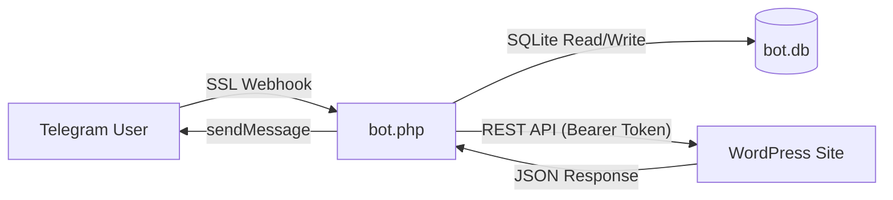

# Telegram WordPress Master Bot v2.1 - Technical Reference Manual

**Version:** 2.1.0  
**License:** MIT  
**Author:** Shahin Ilderemi  
**Stack:** PHP 7.4+, SQLite3, WordPress REST API

---

## 📖 Introduction

The **Telegram WordPress Master Bot** is a production-grade, "headless" management system that decouples the WordPress administration interface from the WordPress backend. By utilizing the Telegram Bot API as a frontend and a lightweight custom WordPress plugin as a middleware API, this system allows agencies, freelancers, and power users to manage unlimited WordPress sites—single instances or massive Multisite Networks—from a single chat interface.

This manual documents the complete functionality, architecture, installation, and extension API of the system.

---

## 🏗 System Architecture

The system operates on a **Client-Server-Agent** model:

1.  **The Client (Telegram App)**: The UI layer. Renders menus, dashboards, and inputs via specialized "Inline Keyboards".
2.  **The Server (`telegram_wordpress_bot.php`, often deployed as `bot.php`)**: The centralized "Brain", hosted on any PHP server (shared/VPS).
    *   **State Machine**: Manages user sessions and navigation flow using SQLite.
    *   **Webhook Handler**: Processes incoming updates from Telegram (Messages, Callbacks, Files), gated by a webhook secret and an admin allowlist.
    *   **Proxy Logic**: Forwards commands to specific WordPress sites via secure REST calls.
3.  **The Agent (`wp-telegram-connector.php`)**: The "Limb" installed on WordPress.
    *   **API Exposure**: Registers a custom namespace `tgwp/v1`.
    *   **Security Layer**: Validates the Bearer Token (timing-safe). Note: a valid token grants the full set of actions — there is no per-endpoint capability scoping yet (see Security Notes).
    *   **Execution**: Performs the actual WordPress actions (CRUD, System Tasks).

### Data Flow Diagram


---

## 🛠 Feature Specifications

Status legend: **✅ Wired** = usable from the Telegram UI end-to-end · **🧩 API only** =
REST endpoint exists but no Telegram button yet · **🔜 Planned** = not implemented.
See [Status & Roadmap](#-status--roadmap) for the at-a-glance summary.

### 1. Multisite Network Management
Support for WordPress Multisite (WPMU).
*   **Discovery** ✅: Automatically detects whether a connected site is a Multisite Network.
*   **Network Dashboard** ✅: When the connected site is a network root, the bot shows a **Network Admin** dashboard.
*   **Site Management**:
    *   **List Sites** ✅: Lists sub-sites / mapped domains.
    *   **Visit / Context Switch** ✅: "Visit" a child site to scope subsequent actions to it.
    *   **Create Site** 🧩: Provision a child site (Domain, Title, Admin Email) — `POST /sites`.
    *   **Delete Site** 🧩: Irreversible child-site removal — `POST /sites` (main site protected).

### 2. Extension Management (Plugins & Themes)
A remote installer and manager.
*   **Listing** ✅: View active, inactive, and network-active plugins/themes.
*   **Search & Install** ✅:
    *   **Repo Search**: Type a keyword (e.g., "SEO") to search the official WordPress.org repository.
    *   **One-Click Install**: Installs directly from search results.
*   **ZIP Upload** ✅: Upload a `.zip` to the chat; the bot passes the Telegram file URL to WordPress, which downloads and installs it.
*   **Lifecycle Actions**:
    *   **Activate/Deactivate** ✅: Toggles state, including "Network Activate" context.
    *   **Plugin Delete** ✅: Removes files (guarded by a confirmation step).
    *   **Theme Switch** ✅ / **Theme Delete** 🧩.

### 3. Content Management
*   **Posts**:
    *   **Browse** ✅: Recent posts with status icons (🟢 Published, 📝 Draft, 🕒 Scheduled).
    *   **Compose** ✅: Title → body → choose **Publish now**, **Save draft**, or **Schedule** (future date/time).
    *   **Edit** 🧩 / **Delete (trash)** 🧩: `POST /posts` (edit) and `DELETE /posts/{id}`.
*   **Media Library** 🧩: `POST /media` sideloads a file from a URL into the library. Sending a Telegram photo/voice note straight to the library is not yet wired in the UI.
*   **Comments**:
    *   **Moderation Queue** ✅: View pending comments.
    *   **Actions** ✅: Approve, Spam, Trash.
    *   **Reply** 🧩: `POST /comments` with `action=reply`.

### 4. System & Maintenance
*   **Updates** ✅: Lists available updates and runs the bulk WP upgraders (`type=plugin|theme|all`).
*   **Database** ✅: Runs `OPTIMIZE TABLE` across all tables.
*   **Cache** ✅: Flushes the object cache and known 3rd-party caches (W3TC, WP Super Cache).
*   **Magic Login** ✅: Issues a single-use, 5-minute passwordless `wp-admin` login URL.
*   **Backups** 🔜: Not yet implemented (planned via UpdraftPlus hook).

---

## ⚙️ Installation & Configuration

### Prerequisites
*   **Bot Hosting**: PHP 7.4+, `curl`, `pdo_sqlite` extensions. HTTPS Certificate.
*   **WordPress**: PHP 7.4+.

### Phase 1: The Bot Server
1.  **Download** the `telegram_wordpress_bot.php` file.
2.  **Create local config** (secrets are never hardcoded). Copy `config.local.php.example`
    to `config.local.php` and fill it in:
    ```php
    return [
        'bot_token'      => '123456:ABC...',     // From @BotFather (required)
        'admin_ids'      => [123456789],          // Allow-listed Telegram user IDs (required, non-empty)
        'webhook_secret' => 'a-long-random-hex',  // Required; also passed to setWebhook below
        'debug'          => false,                // true -> writes bot.log
    ];
    ```
    Every value can alternatively be supplied via environment variables
    (`TGWP_BOT_TOKEN`, `TGWP_ADMIN_IDS`, `TGWP_WEBHOOK_SECRET`, `TGWP_DEBUG`).
    The bot **refuses to run** unless `bot_token`, `admin_ids`, and `webhook_secret`
    are all set — there is no "open to everyone" mode.
3.  **Deploy**: Upload the bot file to your web server. Ensure `config.local.php`,
    `bot.db`, and `bot.log` are **not** publicly downloadable (they are gitignored;
    on Apache add a deny rule, or place `bot.db` outside the web root).
4.  **Set Webhook** (note the `secret_token` — it must match `webhook_secret`):
    `https://api.telegram.org/bot<TOKEN>/setWebhook?url=https://your-domain.com/bot.php&secret_token=<WEBHOOK_SECRET>`
5.  **Verify**: A browser GET shows nothing useful; only Telegram requests carrying the
    correct `X-Telegram-Bot-Api-Secret-Token` header are processed.

### Phase 2: The WordPress Agent
1.  **Download** `wp-telegram-connector.php`.
2.  **Install**:
    *   Option A: Upload via FTP to `/wp-content/plugins/`.
    *   Option B: ZIP the file -> WP Admin -> Plugins -> Add New -> Upload.
3.  **Activate**: Turn on the plugin.
4.  **Get Credentials**:
    *   Go to **Settings** -> **Telegram Connect**.
    *   Copy the **Site URL** (ensure it's the exact root URL).
    *   Copy the **Secure Token**.

### Phase 3: Pairing
1.  Open the Bot in Telegram.
2.  Type `/start` -> Click **➕ Connect Site**.
3.  **Step A**: Send the **Site URL** (e.g., `https://my-blog.com`).
4.  **Step B**: Send the **Token**.
5.  The bot will verify the connection and add the site to your dashboard.

---

## 🔌 API Reference (wp-telegram-connector.php)

The plugin exposes a REST API namespace `tgwp/v1`. All requests must include the header `Authorization: Bearer <TOKEN>`.

### Global Parameters
*   `site_id` (int, optional): If Multisite, switches context to this Blog ID.

### Endpoints

#### `GET /connect`
**Returns**: Site Information.
```json
{
  "name": "My Blog",
  "url": "https://my-blog.com",
  "multisite": true,
  "subsites": [ ... ]
}
```

#### `GET /stats`
Returns high-level dashboard counts. Also used by the cron health check.
```json
{ "name": "My Blog", "posts": 42, "drafts": 3, "comments_pending": 1, "updates": 2 }
```

#### `GET /sites` (Multisite Only)
**Params**: `page` (int).
**Returns**: List of child sites.
```json
[
  { "id": 2, "domain": "sub.site.com", "path": "/" }
]
```

#### `POST /sites` (Multisite Only)
**Action**: Create or Delete.
**Params**:
*   `action`: 'create' | 'delete'
*   `domain`, `title`, `email` (for create)
*   `id` (for delete)

#### `GET /plugins`
**Params**: `network` (bool).
**Returns**: List of plugins with status.
```json
[
  { "name": "Akismet", "path": "akismet/akismet.php", "active": true }
]
```

#### `POST /plugins`
**Actions**:
*   `activate`: Params `plugin` (path).
*   `deactivate`: Params `plugin` (path).
*   `delete`: Params `plugin` (path).
*   `install`: Params `slug` OR `zip_url`.

#### `GET / POST /themes`
*   **GET**: List installed themes (`slug`, `name`, `version`, `active`).
*   **POST** `action`: `switch` (params `slug`), `delete` (params `slug`), `install` (params `slug` OR `zip_url`).

#### `GET /search`
**Params**: `type` ('plugin'|'theme'), `q` (search term).
**Returns**: Results from WordPress.org API.

#### `GET / POST /posts`
*   **GET**: Recent posts (`id`, `title`, `status`, `date`, `link`). Param `page` (int) paginates.
*   **POST** `action`:
    *   `create`: Params `title`, `content`, `status` ('publish'|'draft'|'future'|'pending'), and `date` (ISO 8601, required when `status=future` and must be in the future).
    *   `edit`: Params `id`, plus `title` and/or `content`.

#### `DELETE /posts/{id}`
Moves the post to trash.

#### `GET / POST /comments`
*   **GET**: Moderation list. Param `status` (default `hold`), `page` (int).
*   **POST** `action`: `approve`, `spam`, `trash` (all need `id`), or `reply` (params `id`, `content`).

#### `GET / POST /users`
*   **GET**: Users (`id`, `login`, `email`, `roles`). Param `page` (int).
*   **POST** `action`: `create` (params `login`, `email`, `role`) or `delete` (param `id`; refuses to delete the current user).

#### `GET / POST /users_ms` (Multisite Only)
Multisite-scoped user management. `POST action=add_existing` (params `user_id`, `role`) adds an existing network user to the current blog; otherwise delegates to `/users`.

#### `GET / POST /woo/orders` (registered only when WooCommerce is active)
*   **GET**: Recent orders (`id`, `status`, `total`, `email`).
*   **POST**: Params `id`, `status` — updates an order's status.

#### `POST /media`
**Params**: `url` (direct link to image/audio), optional `filename`.
**Logic**: Downloads to a temp file, uses `media_handle_sideload`, returns `{ id, url }`.

#### `POST /system`
**Actions**:
*   `flush_cache`: Flushes internal and known 3rd party caches (W3TC, WP Super Cache).
*   `optimize_db`: Runs `OPTIMIZE TABLE` across all tables.
*   `magic_login`: Returns a single-use, 5-minute passwordless `wp-admin` login URL.

#### `POST /updates`
**Params**: `type` ('plugin' | 'theme' | 'all'). Runs the bulk WP upgraders and
returns a log. `GET /updates` lists available plugin/theme updates.

---

## 🤖 Bot Logic & State Machine

The `bot.php` uses a finite state machine stored in SQLite `users` table column `state`.

| State | Description | Triggered By |
| :--- | :--- | :--- |
| `start` | Fresh user. | `/start` |
| `idle` | Viewing a dashboard, no typing expected. | Menus |
| `await_url` | Waiting for Site URL input. | "Connect" button |
| `await_token` | Waiting for Token input. | Valid URL received |
| `search_plugin` | Waiting for text query to search plugins. | "Find Plugin" |
| `search_theme` | Waiting for text query to search themes. | "Find Theme" |
| `upload_plugin`| Waiting for ZIP file upload. | "Upload ZIP" |
| `upload_theme` | Waiting for ZIP file upload. | "Upload ZIP" |
| `post_title`   | Composing a new post — awaiting title. | "✍️ New Post" |
| `post_body`    | Composing a new post — awaiting body. | Title received |
| `post_schedule`| Awaiting future publish date/time. | "🕒 Schedule" |

### Cron Logic
Calling `bot.php?cron=<WEBHOOK_SECRET>` triggers the health-check block:
1.  Iterates all connected sites across all users.
2.  Pings each site's `/stats` endpoint.
3.  If a site does not respond with valid stats, sends an alert to the owning
    user's Telegram ID.

The secret is required — `?cron=1` (or any wrong value) is rejected with HTTP 403.

---

## ❓ Troubleshooting

**Q: Nothing happens when I visit bot.php in a browser.**
A: Correct. The file only processes POST requests from Telegram that carry the
correct `X-Telegram-Bot-Api-Secret-Token` header. A plain browser GET is ignored.

**Q: "Connect Failed" error.**
A:
1.  Check if `allow_url_fopen` is enabled on your WP server.
2.  Ensure your WP site is HTTPS.
3.  Check if a security plugin (Wordfence/iThemes) is blocking the REST API or the User Agent.

**Q: ZIP Upload fails.**
A:
1.  The WP server must be able to download from `api.telegram.org`.
2.  Large files might hit `upload_max_filesize` or `post_max_size` in PHP.ini.
3.  Execution time limits might kill the unzip process.

**Q: Multisite features not showing.**
A: Ensure the connector plugin is Network Activated (or active on the main site) and the connected URL is the Main Site URL.

---

## ✅ Status & Roadmap

**Wired end-to-end (Telegram UI → REST → WordPress):** site connect/pairing,
multisite discovery & network dashboard, plugin list/activate/deactivate/delete
(with delete confirmation), plugin/theme search & install (repo + ZIP upload),
theme list & switch, post browse + compose (publish / draft / **schedule**),
comment moderation (approve / spam / trash), system maintenance (flush cache,
optimize DB, **update-all**, magic login), and cron health monitoring.

**Backend ready, Telegram UI not yet wired:** multisite child create/delete,
multisite user management, comment reply, photo/voice → media upload, post edit/delete.

**Planned (not yet implemented):**
*   AI-assisted post drafting via the Claude API.
*   Role-based access (view-only vs full) on top of the existing admin allowlist.
*   Scheduled analytics digest pushed over the cron channel.

## 🔒 Security Notes
*   Secrets live in `config.local.php` (gitignored) or env vars — never in source.
*   The webhook verifies Telegram's secret-token header; the bot fails closed
    without a token, an admin allowlist, and a webhook secret.
*   User-supplied site URLs are validated against SSRF (HTTPS-only, public hosts).
*   The REST bearer token grants full control of the connected site; treat it as
    an admin credential and rotate it from **Settings → Telegram Connect** if leaked.

## 🧪 Development

Dev tooling is configured via Composer:

```bash
composer install          # install phpunit + phpstan
composer run lint         # php -l on both PHP files
composer run analyze      # phpstan (static analysis of the bot)
composer run test         # phpunit (unit tests, e.g. the SSRF URL guard)
```

Tests set `TGWP_TEST=1` so the bot file can be required without executing the
webhook handler (see `tests/bootstrap.php`). CI runs lint + analysis + tests on
PHP 7.4 and 8.2 via `.github/workflows/ci.yml`. See `CHANGELOG.md` for history.

## 📜 License & Credits

This project is built using:
*   **Telegram Bot API**: For the interface.
*   **WordPress Core**: For the backend logic.

*Created for advanced management scenarios. Use with caution. Always backup before performing remote system operations.*
